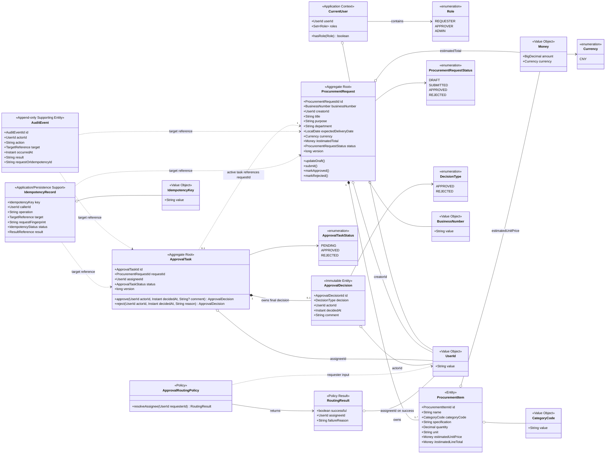
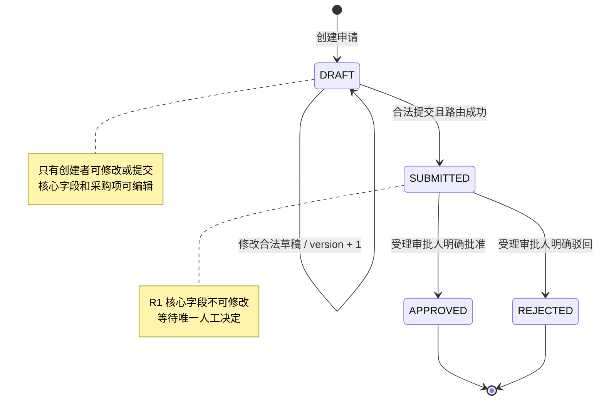
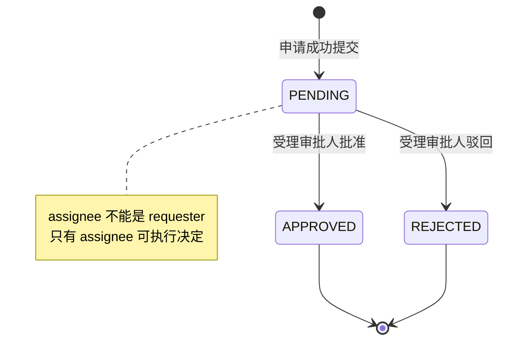

# 据衡 R1 领域模型

- 文档状态：Baselined
- 版本：1.2
- 日期：2026-09-22
- 适用范围：R1 采购授权核心
- 需求基线：`docs/REQUIREMENTS.md` 1.1
- Story 基线：`docs/USER_STORIES.md` 1.0

## 1. 文档目的

本文把 R1 的 Requirement 和 User Story 转换为概念领域模型，说明对象职责、聚合边界、关系、状态和业务不变量。它回答“谁负责维护什么事实以及哪些变化必须一起成立”，不规定 Java 包名、Persistence DO、MyBatis-Plus Mapper、表结构、REST DTO 或具体锁实现。

运行时分层和事务边界以 `docs/ARCHITECTURE.md` 为准；关键命令的交互顺序见 `docs/R1_SEQUENCE_DIAGRAMS.md`。

## 2. R1 范围与非目标

R1 只包含：

- 可信当前用户和最小角色集合。
- 采购申请草稿、采购项、金额计算、查询、修改和提交。
- 单级、单一受理人的审批任务。
- 人工批准或驳回形成的唯一决定。
- 重要写操作的幂等、并发保护和审计。

本文明确不建模：

- 材料、Evidence、Risk、Analysis Run 和 Recommendation。
- 文档解析、对象存储、RAG、LLM、Agent Run 和 Tool Call。
- 持久化 User Aggregate、组织树、多租户和复杂角色继承。
- 数据库 ERD、外键、索引、Persistence DO、MyBatis-Plus Mapper、API 路径和请求 DTO。

## 3. 模型分类

| 分类 | 含义 | R1 对象 |
| --- | --- | --- |
| Aggregate Root | 维护自身一致性边界，只能通过公开业务行为改变状态 | `ProcurementRequest`、`ApprovalTask` |
| Entity | 在聚合内有稳定身份和生命周期 | `ProcurementItem`、`ApprovalDecision` |
| Value Object / 值语义 | 由值定义、不可变或按值比较 | `BusinessNumber`、`Money`、`Currency`、`CategoryCode`、`UserId`、`IdempotencyKey` |
| Application Context | 来自可信运行时但不是业务数据库中的领域实体 | `CurrentUser`、`Role` |
| Domain/Application Policy | 根据确定性规则产生业务选择 | `ApprovalRoutingPolicy` |
| Policy Result | 显式表达策略成功结果或预期业务失败 | `RoutingResult` |
| Supporting Model | 支撑审计和命令可靠性，不属于采购聚合内部 | `AuditEvent`、`IdempotencyRecord` |

该分类是职责约束，不强制每个候选值都立即实现为独立 Java 类。对应 Story 实现时，只有能够集中校验、避免类型混用或显著提升可读性的值才提取为 Value Object。

图中没有单独展开的 `ProcurementRequestId`、`ProcurementItemId`、`ApprovalTaskId`、`ApprovalDecisionId`、`AuditEventId` 等 `XxxId` 表示概念性强类型标识；`TargetReference` 和 `ResultReference` 表示跨模型的稳定类型化引用；`IdempotencyStatus` 等状态类型表示有限生命周期状态。它们是否实现为独立 Value Object、Enum 或其他 Java 类型，由对应 Story 决定，不在概念类图中为每个类型机械增加方框。

## 4. R1 概念类图

图中的虚线表示按标识引用或策略依赖，不表示对象生命周期所有权。`ProcurementRequest` 不持有 `ApprovalTask` 对象集合，`ApprovalTask` 也不直接修改申请；Application Service 在事务中分别加载聚合并调用各自行为。

## 5. 聚合边界与职责

### 5.1 ProcurementRequest Aggregate

负责：

- 创建者、稳定业务编号和采购申请核心字段。
- 至少一个采购项及其生命周期所有权。
- 数量、单价、币种和汇总金额不变量。
- `DRAFT -> SUBMITTED -> APPROVED/REJECTED` 状态转换。
- 修改/提交前的业务状态保护；持久化版本由 Repository 在条件写入时保护。

不负责：

- 解析认证 Token 或决定当前用户是谁。
- 选择审批人的配置来源。
- 创建审计持久化记录。
- 保存审批任务、幂等记录或最终决定。

`ProcurementItem` 只能通过所属申请的业务行为增加、修改或移除，不提供绕过申请校验的独立写用例。

`/estimatedLineTotal` 和 `/estimatedTotal` 使用 UML 派生属性记法。它们分别由数量与预计单价、全部采购项计算得到，不是客户端可独立指定的事实。`ProcurementItem` 在 R1 保留为 Entity，因为稳定的采购项标识有助于修改时识别具体行；这不代表所有明细都必须建模为 Entity，也不因此提前引入任何 R2 类型。

### 5.2 ApprovalTask Aggregate

负责：

- 表示某一申请的一次审批任务并维护自身受理人和生命周期。
- `PENDING -> APPROVED/REJECTED` 状态转换。
- 保存零或一个不可变的最终 `ApprovalDecision`。
- 暴露持久化版本，使 Repository 能够通过条件写入保护并发决定。
- 接收由 Application 提供的可信 `actorId` 和服务端 `decidedAt`，校验 assignee、状态和决定内容，并生成不可变的 `ApprovalDecision`。

不负责：

- 修改 `ProcurementRequest` 内部字段。
- 判断 HTTP 调用者或解析认证信息。
- 执行多级审批、转派、会签或补证流程。

单个 `ApprovalTask` 无法观察同一申请的其他任务，因此它不负责保证跨实例唯一性。“每个 R1 申请最多一个活动任务”由提交用例协调，并由 Repository/Persistence 的唯一性约束最终保证。

### 5.3 AuditEvent

`AuditEvent` 是独立、只追加的支撑模型。业务聚合产生“发生了什么”的事实，由 Application Service 在同一事务中构造并追加审计事件。普通业务流程不得更新或删除既有事件。

R1 审计至少包含 actor、action、target、timestamp、result 和 request/idempotency 标识。技术日志不能替代审计事实。

### 5.4 IdempotencyRecord

`IdempotencyRecord` 保护提交和审批等重要命令，至少绑定：

- 调用者 `callerId`。
- 操作类型。
- 目标对象。
- 幂等键。
- 请求指纹。
- 执行状态及成功结果引用。

它属于 Application/Persistence 支撑边界，不进入采购申请或审批任务聚合。相同绑定和相同指纹在已完成时返回原结果、仍执行时返回明确的 `IN_PROGRESS`；相同键对应不同指纹时返回冲突。具体持久化策略可以选择等待首个事务后 replay，但必须保持最多一次业务副作用。

### 5.5 CurrentUser 与 Role

`CurrentUser` 是由 Web/Security Adapter 从可信认证环境解析并传给 Application 的运行时上下文，不是客户端 DTO，也不是 R1 必须持久化的 `User` Entity。一个用户可以同时拥有多个 `Role`；拥有 `APPROVER` 不会解除“不得审批自己的申请”的职责分离规则。

`CurrentUser` 只存在于 Web/Application 边界。Application 使用它完成角色和数据范围授权，并只把领域行为需要的 `UserId` 或其他业务值显式传给聚合。Domain 不主动读取 `CurrentUser`，不依赖 `CurrentUserProvider`；Application 从申请取得 `creatorId` 并作为 `requesterId` 传给 `ApprovalRoutingPolicy`，不向 Approval 模块传递整个 `ProcurementRequest`。

### 5.6 ApprovalRoutingPolicy 与 RoutingResult

`ApprovalRoutingPolicy` 使用 `RoutingResult` 显式表达预期业务结果，而不是把正常的路由失败全部转换为异常：

- 成功结果必须且只能携带一个不等于 `requesterId` 的 `assigneeId`，不得同时携带失败原因。
- 失败结果不得携带可用 `assigneeId`，并至少区分 `NO_APPROVER`、`MULTIPLE_APPROVERS` 和 `SELF_ASSIGNMENT`。
- 配置读取失败或基础设施异常仍按系统失败处理，不伪装成上述业务失败。

`RoutingResult` 已在 `US-013` 中实现为互斥字段的不可变 record：成功时只有 `assigneeId`，失败时只有 `failureReason`。

## 6. 状态模型

### 6.1 ProcurementRequest 状态

### 6.2 ApprovalTask 状态

申请与任务状态必须由同一个 Application 事务协调：

| ApprovalTask | ProcurementRequest | 是否合法 |
| --- | --- | --- |
| 不存在 | `DRAFT` | 合法 |
| `PENDING` | `SUBMITTED` | 合法 |
| `APPROVED` | `APPROVED` | 合法 |
| `REJECTED` | `REJECTED` | 合法 |
| 其他组合 | 任意 | 表示部分提交或非法业务状态，必须由 Application 事务协调、Domain 状态校验和 Persistence 条件写入共同防止；数据库约束只保护其能够直接表达的局部不变量 |

## 7. 核心业务不变量

### 7.1 采购申请

1. 创建者和初始状态由服务端设置，客户端不能覆盖。
2. 申请至少包含一个采购项。
3. 每个采购项数量大于零，预计单价不得为负，`categoryCode` 必须受控。
4. R1 币种固定为 `CNY`，金额使用十进制定点语义并按明确规则保留两位小数。
5. 行金额和申请预计总额由服务端计算。
6. 只有创建者可以修改或提交自己的 `DRAFT`。
7. Repository 必须通过版本条件写入发现旧版本覆盖；失败更新不能改变任何采购项或审计事实。

### 7.2 提交与路由

1. 成功提交必须同时形成 `SUBMITTED` 申请、一个 `PENDING` 任务和审计记录。
2. 路由必须得到唯一有效审批人；零个、多个或申请人本人均视为失败。
3. 每个 R1 申请最多一个活动任务；提交用例必须协调该不变量，Persistence 必须通过唯一性约束防止并发创建重复活动任务。
4. 相同提交命令的顺序或并发重试最多产生一次业务副作用。

### 7.3 审批决定

1. 只有具备 `APPROVER` 且为任务 assignee 的用户可以决定。
2. 申请创建者不能审批自己的申请，即使同时拥有 `APPROVER`。
3. 决定前任务必须为 `PENDING`，申请必须为 `SUBMITTED`。
4. 驳回原因必填，批准意见可选；actor 和 decidedAt 由服务端提供。
5. 每个任务最多一个最终决定；并发相反决定最多一个成功。
6. 申请状态、任务状态、决定、幂等结果和审计同时提交或同时回滚。

### 7.4 审计与数据范围

1. 创建、修改、提交、任务分配、批准和驳回必须记录审计。
2. 普通业务用例不能修改或删除既有审计事件。
3. 申请查询按 creator 范围，任务查询按 assignee 范围；不能先取出无权数据再由前端过滤。
4. 请求体中的 userId、角色和受理人声明不能覆盖可信上下文或服务端路由。

## 8. 跨聚合协调

聚合分别维护局部不变量，Application Service 维护用例级原子性：

| 命令 | 涉及聚合/支撑模型 | 协调责任 |
| --- | --- | --- |
| CreateDraft | `ProcurementRequest`、`AuditEvent` | 创建合法申请、计算金额、生成业务编号并追加审计 |
| UpdateDraft | `ProcurementRequest`、`AuditEvent` | 校验所有权、调用聚合修改行为、按预期版本条件保存并追加审计 |
| SubmitRequest | `ProcurementRequest`、`ApprovalTask`、`IdempotencyRecord`、`AuditEvent` | 幂等、路由、两个聚合状态和审计的原子提交 |
| DecideApproval | `ApprovalTask`、`ProcurementRequest`、`ApprovalDecision`、`IdempotencyRecord`、`AuditEvent` | 权限、自审、版本条件保存、唯一决定和两个聚合终态的原子提交 |

Domain 对象不调用 Repository，也不自行开启事务。Application Service 不能跳过聚合行为直接写状态字段。

## 9. R1 所需端口

以下是职责边界，不是要求为每个类创建接口：

| 端口/策略 | 所属边界 | 目的 |
| --- | --- | --- |
| `CurrentUserProvider` | Identity/Web-Security Adapter | 从可信认证环境解析 `CurrentUser`，供 Web 入口传入 Application；不读取请求体身份声明 |
| `ProcurementRequestRepository` | Procurement/Application Port | 按所有者/标识加载并保存申请，支持版本保护和分页 |
| `ApprovalTaskRepository` | Approval/Application Port | 按 assignee 查询任务并支持条件更新 |
| `AuditEventStore` | Audit/Application Port | 在业务事务中只追加审计事件 |
| `AuditTrailQueryRepository` | Audit/Application Port | 按申请创建者或任务受理人范围稳定读取只读审计轨迹，不提供更新或删除能力 |
| `IdempotencyStore` | Application Port | 原子占用幂等键、检测请求指纹并保存结果引用 |
| `ApprovalRoutingPolicy` | Approval Policy | 根据最小输入 `requesterId` 及服务端配置返回显式 `RoutingResult`；成功结果携带唯一非本人 `assigneeId`，失败结果携带原因；不读取 `CurrentUser` 或整个申请聚合 |
| `BusinessNumberGenerator` | Procurement/Application Port | 生成稳定且唯一的可展示业务编号 |
| `Clock` | Common Port | 为决定和审计提供可测试的服务端时间 |

具体 Repository 方法、Spring Bean、数据库锁和唯一约束在对应 Story 的实施计划中确定。

## 10. Requirement 与 Story 追溯

| 设计区域 | Requirement / Rule | User Story |
| --- | --- | --- |
| CurrentUser/Role | `FR-IAM-001`～`005` | `US-003` |
| ProcurementRequest/Item/Money | `FR-PR-001`～`007`、`010`、`011`、`BR-001`、`002`、`004` | `US-010`～`US-012` |
| Submit + Routing + Idempotency | `FR-PR-008`、`009`、`FR-APP-001`、`002`、`BR-003`、`006`、`008` | `US-013` |
| ApprovalTask/Decision | `FR-APP-003`～`007`、`FR-IAM-004`、`BR-005`～`008` | `US-014`、`US-015` |
| AuditEvent | `FR-AUD-001`、`003`、`005`、`006` | `US-010`、`US-012`、`US-013`、`US-015`、`US-016` |

## 11. 已确定与仍待对应 Story 决定

1. `US-003` 已采用无状态 HTTP Basic 和内存演示身份，通过 `CurrentUserProvider` 隔离认证适配器。
2. `US-010` 已采用 `PR-yyyyMMdd-数据库序列值` 业务编号；序列保证唯一递增但不保证无空洞。
3. `US-013` 已采用配置候选人的单审批人路由；零个、多个或唯一候选人为申请人本人时均显式失败。
4. `US-012`、`US-013` 已采用显式 `status + version` 条件更新；`US-015` 对审批任务采用 `id + assignee + PENDING + version` 条件更新，并由每任务唯一决定约束共同防止双重决定。
5. `US-016` 已采用申请创建者或任务受理人二选一的数据范围，并按事件发生时间与 ID 稳定读取；查询端口只读。
6. R1 是否提供 `ADMIN` 业务接口仍待决定；当前模型只保留角色。

## 12. 评审检查

- 类图是否只包含 R1 概念，没有提前引入 R2/R3。
- 聚合所有权和按 ID 引用是否清晰。
- `CurrentUser` 是否明确为可信上下文而非客户端或持久化 User Entity。
- 派生金额是否只有一个计算事实源，而不是可由客户端独立赋值。
- 活动任务唯一性是否明确由提交用例与 Persistence 约束保证，而非错误归给单个 `ApprovalTask`。
- Approval 模块是否只接收路由所需的最小输入，而不依赖整个采购申请聚合。
- 路由成功和预期业务失败是否都能由 `RoutingResult` 显式表达。
- 概念性强类型标识、引用和状态是否有统一语义，而不是被误解为任意字符串。
- `IdempotencyRecord` 和 `AuditEvent` 是否与核心采购聚合解耦。
- 申请和任务状态组合是否覆盖所有合法终态。
- 提交和审批是否能够由 Application 事务协调而不让聚合互相直接修改。
- 所有核心不变量是否能够追溯到 Requirement 和 User Story。
