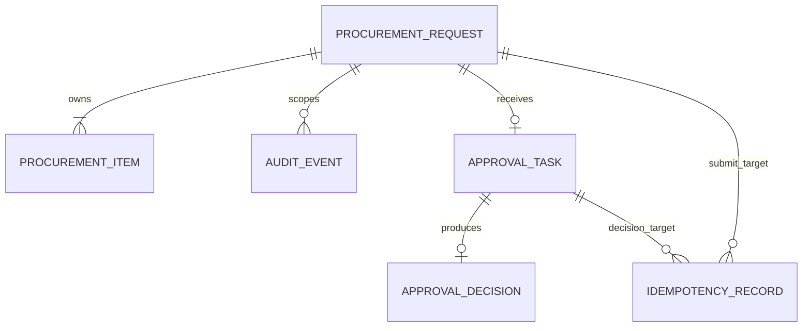
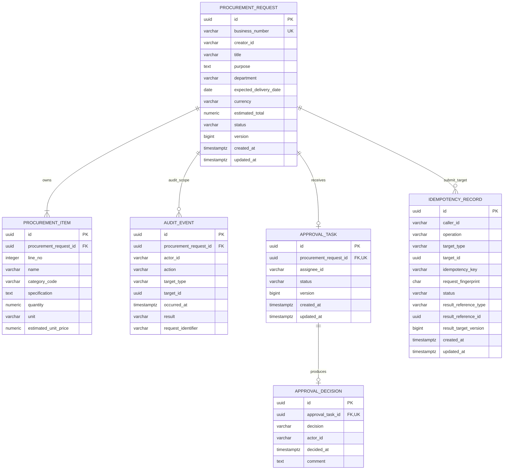

# 据衡 R1 数据库关系模型

- 文档状态：Baselined
- 版本：1.5
- 当前物理范围：截至 US-017 查看最终审批结果
- 数据库：PostgreSQL 17

## 1. 文档目的

本文把 R1 概念领域模型转换为可落地的关系模型。它同时保留两种视角：

1. R1 关系演进总览，用来避免当前表结构阻塞后续提交和审批 Story。
2. 截至当前 Story 的物理 ERD，只对已经进入实现的表定义完整字段、类型和约束。

后续表出现在总览中不表示已经实现。每个 Story 仍通过独立 Flyway 迁移增加自己的表和约束；US-013 增加提交用例必需的审批任务和幂等记录，US-014 增加任务查询索引，US-015 通过 V6 增加每任务唯一的人工审批决定，US-016 复用既有审计表与索引提供带数据范围的只读查询，US-017 复用 V6 的任务外键和每任务唯一约束读取最终决定，后二者均不新增迁移。

## 2. R1 关系演进总览

| 对象 | 首次落库 Story | 当前状态 |
| --- | --- | --- |
| `procurement_request` | US-010 | 已落库 |
| `procurement_item` | US-010 | 已落库 |
| `audit_event` | US-010 | 已落库；US-013/US-015 复用写入；US-016 启用授权查询 |
| `approval_task` | US-013 | 已落库；US-014 增加查询索引；US-015 启用终态条件更新 |
| `approval_decision` | US-015 | 已落库；US-017 启用带创建者或受理人范围的只读查询 |
| `idempotency_record` | US-013 | 已落库 |

R1 不建立 `user` 表。`creator_id`、`actor_id` 和 `assignee_id` 保存可信认证上下文中的稳定用户 ID，不对客户端提供的身份声明建立信任。

## 3. 截至 US-017 的物理 ERD

### 3.1 已实现的查询索引

下表列出截至 US-017 由 Flyway 显式创建、用于业务查询的非约束索引。主键和 `UNIQUE` 约束对应的 PostgreSQL 自动索引仍由各表约束定义，本表不重复列出。V6 的 `UNIQUE (approval_task_id)` 已为按任务读取唯一决定建立约束索引，因此不再增加重复索引。

| 索引 | 表与列顺序 | 用途 | 引入 Story / 迁移 |
| --- | --- | --- | --- |
| `idx_audit_event_request_time` | `audit_event (procurement_request_id, occurred_at, id)` | US-016 按授权申请范围与时间、事件 ID 稳定升序读取审计轨迹 | US-010 / V2；US-016 启用 |
| `idx_procurement_request_creator_created_id` | `procurement_request (creator_id, created_at DESC, id DESC)` | 当前申请人范围内的稳定分页 | US-011 / V3 |
| `idx_procurement_request_creator_status_created_id` | `procurement_request (creator_id, status, created_at DESC, id DESC)` | 当前申请人按状态筛选并稳定分页 | US-011 / V3 |
| `idx_approval_task_assignee_created_id` | `approval_task (assignee_id, created_at DESC, id DESC)` | 当前审批人范围内的任务稳定分页 | US-014 / V5 |
| `idx_approval_task_assignee_status_created_id` | `approval_task (assignee_id, status, created_at DESC, id DESC)` | 当前审批人按任务状态筛选并稳定分页 | US-014 / V5 |

审批任务详情使用主键 `id` 与可信 `assignee_id` 组成联合查询条件。当前没有为该详情查询额外创建 `(id, assignee_id)` 索引，因为主键先定位单行后再校验受理人已经满足 R1 查询规模；后续只有在实际执行计划证明有需要时才增加冗余索引。

## 4. 表职责与关键约束

### 4.1 procurement_request

- `id` 使用 Java 生成的 UUID，`business_number` 是面向用户展示的稳定唯一编号。
- 业务编号格式为 `PR-yyyyMMdd-序列值`。序列只保证唯一和递增，不承诺无空洞；事务回滚消耗序列值属于正常行为。
- `creator_id` 只能来自可信 `CurrentUser`。
- `currency` 在 R1 只允许 `CNY`，`status` 创建时只能为 `DRAFT`。
- `estimated_total` 使用 `numeric(19,2)`，由服务端汇总所有行金额后写入。
- `version` 初始为 `0`，供 US-012 的条件更新使用。
- `created_at`、`updated_at` 使用 UTC `Instant` 映射到 `timestamptz`。

### 4.2 procurement_item

- 采购项只能依附一个申请存在，通过外键关联聚合根。
- `line_no` 在同一申请内唯一，使返回顺序稳定。
- `quantity` 使用 `numeric(19,4)` 且必须大于零。
- `estimated_unit_price` 使用 `numeric(19,2)` 且不得为负。
- 首批受控品类为 `LAPTOP`、`MONITOR`、`OFFICE_CHAIR`、`SOFTWARE_LICENSE`。
- 行金额不重复存储。服务端以 `quantity × estimated_unit_price` 计算，并使用 `HALF_UP` 保留两位小数；申请总额等于各个已舍入行金额之和。

### 4.3 audit_event

- 审计事件只追加，不提供普通业务更新或删除端口。
- `procurement_request_id` 是 R1 审计查询的数据范围根；`target_type + target_id` 表示本次动作直接作用的对象。
- 已支持的 action 包括 `PROCUREMENT_REQUEST_CREATED`、`PROCUREMENT_REQUEST_UPDATED`；US-013 增加 `PROCUREMENT_REQUEST_SUBMITTED` 和 `APPROVAL_TASK_ASSIGNED`，US-015 增加 `APPROVAL_TASK_APPROVED` 和 `APPROVAL_TASK_REJECTED`，成功事件的 result 为 `SUCCESS`。
- `request_identifier` 对创建/修改保存服务端请求标识，对提交/决定保存已经过长度校验并由服务端绑定调用者、操作和目标的幂等标识；它只用于关联请求，不是认证凭据，也不能覆盖操作者或审计归属。
- 创建或修改申请时，相应申请数据和审计必须在同一个本地数据库事务中提交或回滚。提交申请时，申请状态、审批任务、两个审计事件和幂等完成结果必须整体提交或整体回滚。
- US-016 查询先使用可信当前用户 ID 校验申请创建者或关联任务受理人范围，并在事件查询中重复携带同一范围条件；无权与不存在统一返回无内容的 404。事件按 `occurred_at ASC, id ASC` 稳定排序，普通业务接口只读且只返回白名单字段。

### 4.4 approval_task

- `id` 使用 Java 生成的 UUID；`procurement_request_id` 外键关联被审批的采购申请。
- 字段类型为：`id uuid`、`procurement_request_id uuid`、`assignee_id varchar(100)`、`status varchar(20)`、`version bigint`、`created_at timestamptz`、`updated_at timestamptz`，全部非空。
- R1 不支持撤回、重新提交和多级审批，因此 `procurement_request_id` 使用唯一约束，表示一份申请在 R1 最多创建一个审批任务，而不只是“最多一个活动任务”。
- `assignee_id` 只能来自服务端审批路由结果，不能接受客户端指定；路由到申请创建者本人时不得创建任务。
- 创建时 `status` 必须为 `PENDING`；US-015 只允许当前受理审批人把它转换为 `APPROVED` 或 `REJECTED`，数据库检查约束允许这三个 R1 状态。
- `version` 初始为 `0`。US-015 使用 `id + assignee_id + status = PENDING + expected version` 条件更新竞争唯一终态，成功后版本递增。`created_at`、`updated_at` 使用服务端时间。
- 任务唯一性由提交用例与 `UNIQUE (procurement_request_id)` 共同保护；并发使用不同幂等键提交同一申请时，该约束仍是最后一道防线。
- US-014 使用 `assignee_id + created_at DESC + id DESC` 支持本人任务稳定分页，并使用 `assignee_id + status + created_at DESC + id DESC` 支持状态筛选；任务详情查询同时携带任务 ID 和可信 `assignee_id`。

### 4.5 approval_decision

- 字段类型为：`id uuid`、`approval_task_id uuid`、`decision varchar(20)`、`actor_id varchar(100)`、`decided_at timestamptz`、`comment text`。
- `approval_task_id` 外键关联审批任务并使用唯一约束，因此每个任务最多形成一个最终决定；R1 不提供修改或删除决定的普通业务端口。
- `decision` 只允许 `APPROVED` 或 `REJECTED`，且必须与同事务写入的任务和申请终态一致。
- `actor_id` 只来自可信 `CurrentUser`，`decided_at` 由服务端时钟产生并规范到 PostgreSQL 可稳定重放的微秒精度。
- `APPROVED` 的 `comment` 可以为空；非空意见去除首尾空白且最多 2000 字符。`REJECTED` 必须包含非空 `comment`，Java 领域规则和数据库 `CHECK` 同时保护该约束。
- Application 先条件更新任务，命中一行后才插入决定；随后条件更新仍为 `SUBMITTED` 的申请、追加审计并完成幂等记录。任一步失败时同一数据库事务整体回滚。
- US-017 通过申请、任务和决定的联结查询，同时使用可信 `viewerId` 限定申请创建者或任务受理人；只有决定真实存在时才返回白名单字段。尚无决定、不存在和越权统一为空查询结果并映射为安全 404，读取不改变任何状态。

### 4.6 idempotency_record

- 幂等作用域由 `caller_id + operation + target_type + target_id + idempotency_key` 组成，并建立组合唯一约束。相同 key 可以安全地用于不同调用者、操作或目标。
- 字段类型为：`id uuid`、`caller_id varchar(100)`、`operation varchar(80)`、`target_type varchar(50)`、`target_id uuid`、`idempotency_key varchar(64)`、`request_fingerprint char(64)`、`status varchar(20)`、`result_reference_type varchar(50)`、`result_reference_id uuid`、`result_target_version bigint`、`created_at timestamptz`、`updated_at timestamptz`。只有三个结果字段可在 `IN_PROGRESS` 状态下为空。
- US-013 的 `operation` 为 `SUBMIT_PROCUREMENT_REQUEST`，`target_type` 为 `PROCUREMENT_REQUEST`，`target_id` 为待提交申请 ID。
- US-015 的 `operation` 为 `DECIDE_APPROVAL`，`target_type` 为 `APPROVAL_TASK`，`target_id` 为待决定任务 ID；批准与驳回共享该作用域，确保相同键改变决定类型时得到幂等冲突。
- `request_fingerprint` 是服务端对影响命令语义的规范化输入计算出的 SHA-256 十六进制摘要；US-013 至少包含客户端提交的申请版本，US-015 包含决定类型、任务版本和规范化意见。同一作用域下摘要不同必须返回幂等冲突。
- 状态只包含 `IN_PROGRESS` 和 `COMPLETED`。首次请求通过 `INSERT ... ON CONFLICT DO NOTHING` 竞争执行权；并发相同请求由 PostgreSQL 唯一索引协调，失败事务回滚后不保留伪完成记录。
- `result_reference_type`、`result_reference_id` 和 `result_target_version` 保存重放响应所需的最小结果引用。`IN_PROGRESS` 时三者必须为空，`COMPLETED` 时三者必须完整。
- 结果引用是跨用例的通用引用，不建立多态外键。Application 只能写入本次事务已经成功持久化的结果，并在读取时按可信操作类型解析。
- 幂等记录与业务副作用处于同一个本地数据库事务：业务失败时记录一起回滚，业务成功但幂等结果未完成时整个事务不得提交。

## 5. 数据库与 Java 双重保护

| 不变量 | Java 保护 | PostgreSQL 保护 |
| --- | --- | --- |
| 至少一个采购项 | Web 与 Domain 校验 | 当前通过事务写入测试保证；跨表数量不使用触发器 |
| 数量大于零 | Bean Validation 与 Domain | `CHECK (quantity > 0)` |
| 单价非负且两位小数 | Bean Validation 与 Money | `numeric(19,2)` 与 `CHECK` |
| 品类受控 | 请求校验与 `CategoryCode` | `CHECK category_code IN (...)` |
| 币种为 CNY | Domain 固定设置 | `CHECK (currency = 'CNY')` |
| 初始状态为 DRAFT | Domain 工厂固定设置 | 创建迁移允许全部 R1 状态，Application 只写 `DRAFT` |
| 业务编号唯一 | 业务编号生成器 | UNIQUE |
| 申请与审计原子提交 | Application `@Transactional` | 同一 PostgreSQL 事务与外键 |
| 只有 DRAFT 可提交 | Domain 状态转换 | 条件更新限定 `status = 'DRAFT'` 与期望 `version` |
| 一份 R1 申请最多一个审批任务 | 提交用例只创建一次 | `UNIQUE (procurement_request_id)` |
| 审批人不能是申请人 | 路由与最终决定用例都显式拒绝自审 | 数据库无法跨表表达，由事务和集成测试保证 |
| 同一幂等作用域唯一 | Application 解释获取、重放与冲突 | 五列组合 UNIQUE，原子插入竞争执行权 |
| 完成幂等记录必须有结果 | 幂等组件只在业务写入成功后完成 | `CHECK` 约束状态与三个结果字段的空值组合 |
| 提交副作用原子完成 | Application `@Transactional` | 申请、任务、审计、幂等记录位于同一事务 |
| 每个任务最多一个最终决定 | Domain 只允许 PENDING 转终态 | `UNIQUE (approval_task_id)` |
| 驳回原因必填 | Web 与 Domain 校验 | 决定类型与 `comment` 组合 `CHECK` |
| 审批双聚合状态一致 | Application 协调两个聚合的状态机和条件保存 | 任务、决定、申请、审计、幂等记录位于同一事务 |

数据库不能独立表达“一个申请至少一条明细”这种跨表计数不变量，R1 不为此引入触发器。该规则由 Domain 创建工厂、Application 事务和集成测试共同保证。

## 6. Flyway 演进边界

- `V1` 建立空基线；`V2` 创建采购申请、采购项、审计事件和业务编号序列；`V3` 增加采购申请查询索引。
- US-013 使用独立的 `V4` 创建 `approval_task` 和 `idempotency_record`，不改写已经执行过的迁移。
- US-014 使用独立的 `V5` 增加审批任务受理人分页和状态筛选索引，不新增业务表或修改任务生命周期字段。
- US-015 使用独立的 `V6` 创建 `approval_decision`，通过任务外键、每任务唯一约束、决定类型检查和驳回原因检查保护最终决定。
- US-016 直接使用 V2 的审计表和 `idx_audit_event_request_time`，没有 schema 变化，因此不创建空的 V7 迁移。
- US-017 直接使用 V6 的 `approval_decision`、任务外键和 `UNIQUE (approval_task_id)` 约束索引，没有 schema 变化，因此同样不创建空迁移。
- `procurement_request.status` 在 `V2` 已允许 `SUBMITTED`，`audit_event` 也可承载新的 action，因此 V4 不需要为提交动作修改这两张表。
- V4 不提前创建 `approval_decision`；V6 也不预建材料、证据、风险或 AI 相关结构。

## 7. 当前明确不落库

- 用户、角色和组织表。
- 供应商、报价、合同和材料。
- Evidence、Risk、Analysis Run、Recommendation、Agent Run 和 Tool Call。
- 商品主数据表；品类使用受控枚举和数据库检查约束。
