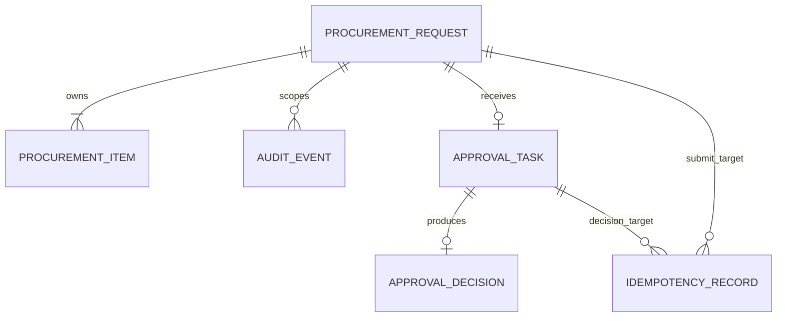
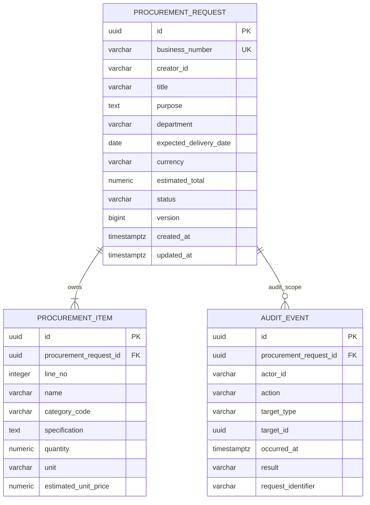

# 据衡 R1 数据库关系模型

- 文档状态：Baselined
- 版本：1.0
- 当前物理范围：US-010 创建采购申请草稿
- 数据库：PostgreSQL 17

## 1. 文档目的

本文把 R1 概念领域模型转换为可落地的关系模型。它同时保留两种视角：

1. R1 关系演进总览，用来避免当前表结构阻塞后续提交和审批 Story。
2. 当前 Story 的物理 ERD，只对已经进入实现的表定义完整字段、类型和约束。

后续表出现在总览中不表示已经实现。每个 Story 仍通过独立 Flyway 迁移增加自己的表和约束，禁止在 US-010 中提前创建审批、决定或幂等表。

## 2. R1 关系演进总览

| 对象 | 首次落库 Story | 当前状态 |
| --- | --- | --- |
| `procurement_request` | US-010 | 本次实现 |
| `procurement_item` | US-010 | 本次实现 |
| `audit_event` | US-010 | 本次实现 |
| `approval_task` | US-013 | 仅关系占位 |
| `approval_decision` | US-015 | 仅关系占位 |
| `idempotency_record` | US-013 | 仅关系占位 |

R1 不建立 `user` 表。`creator_id`、`actor_id` 和未来的 `assignee_id` 保存可信认证上下文中的稳定用户 ID，不对客户端提供的身份声明建立信任。

## 3. US-010 物理 ERD

## 4. 表职责与关键约束

### 4.1 procurement_request

- `id` 使用 Java 生成的 UUID，`business_number` 是面向用户展示的稳定唯一编号。
- 业务编号格式为 `PR-yyyyMMdd-序列值`。序列只保证唯一和递增，不承诺无空洞；事务回滚消耗序列值属于正常行为。
- `creator_id` 只能来自可信 `CurrentUser`。
- `currency` 在 R1 只允许 `CNY`，`status` 创建时只能为 `DRAFT`。
- `estimated_total` 使用 `numeric(19,2)`，由服务端汇总所有行金额后写入。
- `version` 初始为 `0`，供 US-012 的条件更新使用。
- `created_at`、`updated_at` 使用 UTC `Instant` 映射到 `timestamptz`。

### 4.2 procurement_item

- 采购项只能依附一个申请存在，通过外键关联聚合根。
- `line_no` 在同一申请内唯一，使返回顺序稳定。
- `quantity` 使用 `numeric(19,4)` 且必须大于零。
- `estimated_unit_price` 使用 `numeric(19,2)` 且不得为负。
- 首批受控品类为 `LAPTOP`、`MONITOR`、`OFFICE_CHAIR`、`SOFTWARE_LICENSE`。
- 行金额不重复存储。服务端以 `quantity × estimated_unit_price` 计算，并使用 `HALF_UP` 保留两位小数；申请总额等于各个已舍入行金额之和。

### 4.3 audit_event

- 审计事件只追加，不提供普通业务更新或删除端口。
- `procurement_request_id` 是 R1 审计查询的数据范围根；`target_type + target_id` 表示本次动作直接作用的对象。
- 当前创建事件的 action 为 `PROCUREMENT_REQUEST_CREATED`，result 为 `SUCCESS`。
- `request_identifier` 由服务端生成，不接受客户端身份或审计归属覆盖。
- 申请、采购项和创建审计必须在同一个本地数据库事务中提交或回滚。

## 5. 数据库与 Java 双重保护

| 不变量 | Java 保护 | PostgreSQL 保护 |
| --- | --- | --- |
| 至少一个采购项 | Web 与 Domain 校验 | 当前通过事务写入测试保证；跨表数量不使用触发器 |
| 数量大于零 | Bean Validation 与 Domain | `CHECK (quantity > 0)` |
| 单价非负且两位小数 | Bean Validation 与 Money | `numeric(19,2)` 与 `CHECK` |
| 品类受控 | 请求校验与 `CategoryCode` | `CHECK category_code IN (...)` |
| 币种为 CNY | Domain 固定设置 | `CHECK (currency = 'CNY')` |
| 初始状态为 DRAFT | Domain 工厂固定设置 | 创建迁移允许全部 R1 状态，Application 只写 `DRAFT` |
| 业务编号唯一 | 业务编号生成器 | UNIQUE |
| 申请与审计原子提交 | Application `@Transactional` | 同一 PostgreSQL 事务与外键 |

数据库不能独立表达“一个申请至少一条明细”这种跨表计数不变量，R1 不为此引入触发器。该规则由 Domain 创建工厂、Application 事务和集成测试共同保证。

## 6. 当前明确不落库

- 用户、角色和组织表。
- 审批任务、审批决定与幂等记录。
- 供应商、报价、合同和材料。
- Evidence、Risk、Analysis Run、Recommendation、Agent Run 和 Tool Call。
- 商品主数据表；品类使用受控枚举和数据库检查约束。
