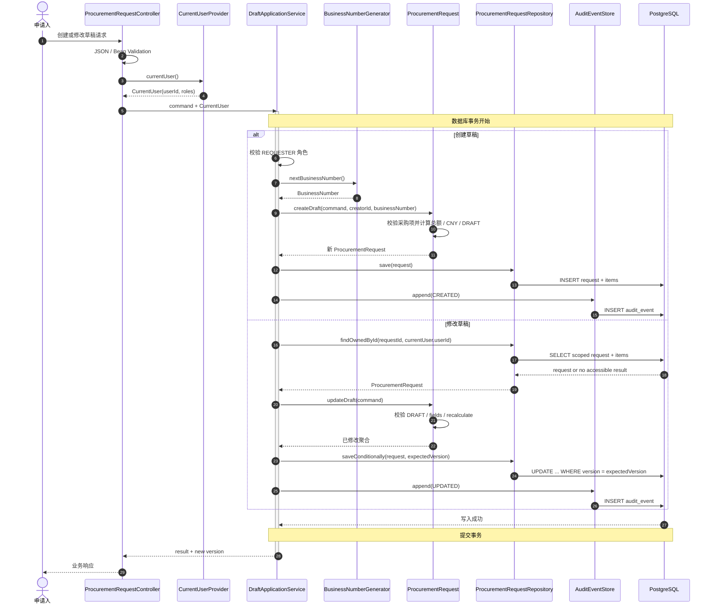
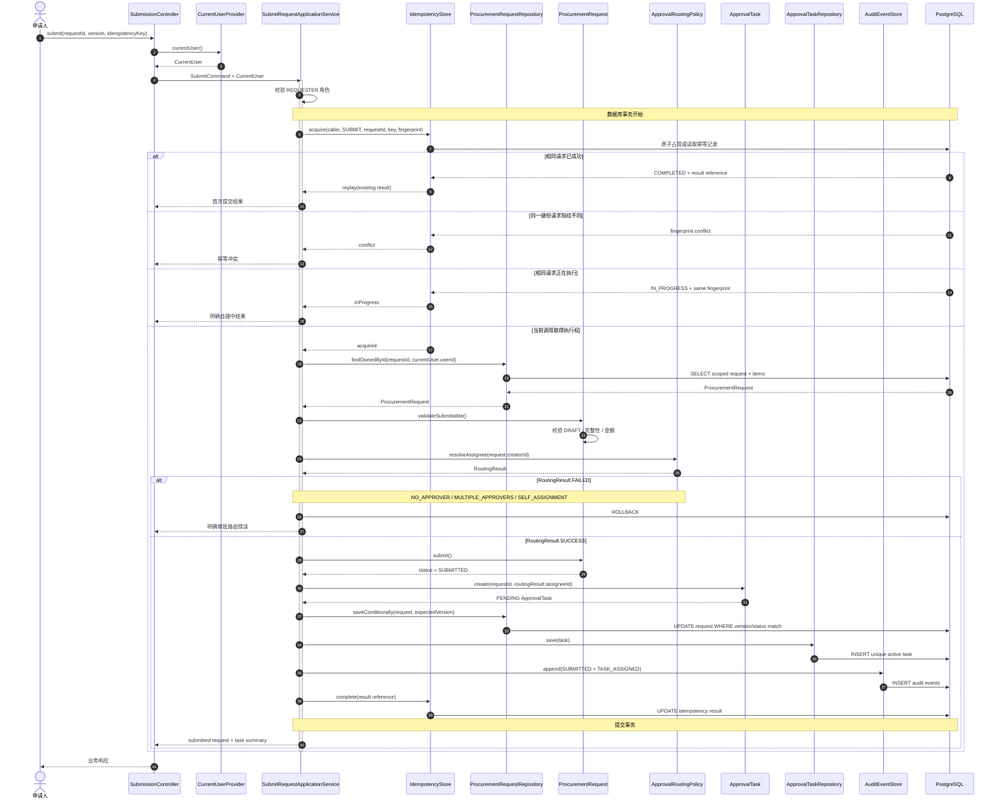
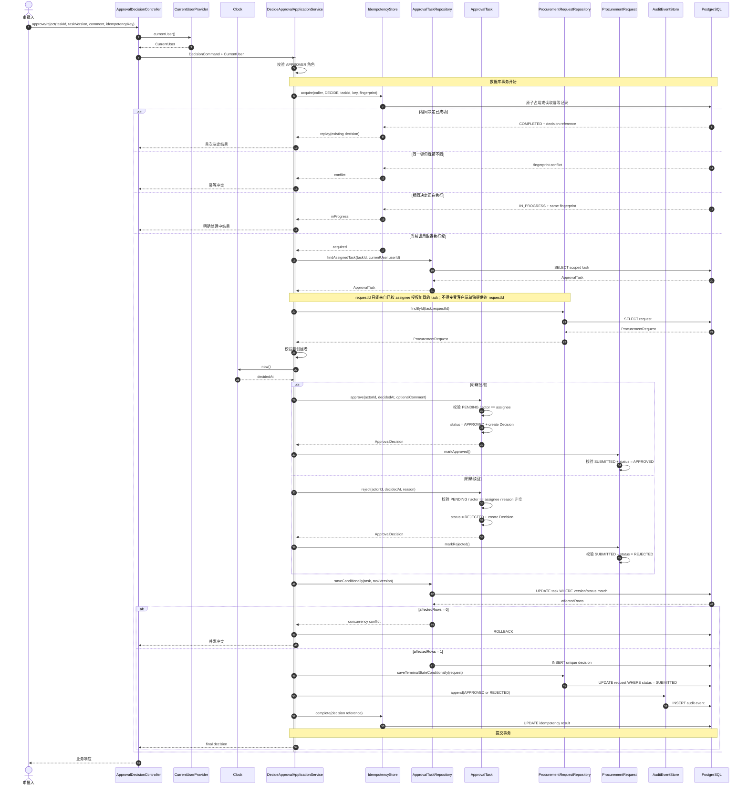

# 据衡 R1 关键流程时序图

- 文档状态：Baselined
- 版本：1.2
- 日期：2026-09-22
- 适用范围：R1 采购授权核心
- 关联领域模型：`docs/R1_DOMAIN_MODEL.md`

## 1. 文档目的

本文描述 R1 三个关键运行流程从 Web 入口到数据库的职责分工、事务边界和失败路径：

1. 创建或修改采购申请草稿。
2. 提交采购申请并创建审批任务。
3. 人工批准或驳回。

图中的类名是职责名称，不是已经实现的 Java API。具体 Controller、方法、DTO、Repository 和表结构只在对应 User Story 启动时确定。

## 2. 共同行为约定

- Web 层只处理协议、输入格式和响应映射。
- Web/Security Adapter 通过 `CurrentUserProvider` 从可信认证环境解析身份和完整角色集合，并将不可由请求体覆盖的 `CurrentUser` 传给 Application。
- Application Service 负责权限、事务、幂等和跨聚合协调。
- Domain Aggregate 负责状态转换和本地业务不变量。
- Repository 查询必须携带必要的数据范围。
- 审计与业务状态在同一 PostgreSQL 事务中写入。
- 权限、校验、状态和并发冲突不自动重试。
- LLM 和 Agent 不出现在任何 R1 授权命令链路中。

## 3. 创建或修改采购申请草稿

覆盖 `US-010` 和 `US-012`。创建与修改共享同一分层路径，但修改额外要求所有权、状态和版本检查。



### 3.1 失败路径

| 失败 | 行为 |
| --- | --- |
| JSON/字段格式错误 | Web 返回统一字段错误，不进入 Application 事务 |
| 非 `REQUESTER` | Application 拒绝，不加载或写入业务对象 |
| 修改他人申请 | scoped Repository 不返回可访问聚合；不泄漏资源详情 |
| 非 `DRAFT` | Domain 返回状态冲突，不保存任何字段 |
| 旧版本修改 | 条件更新影响零行，返回并发冲突，不覆盖新版本 |
| 金额/采购项非法 | Domain 校验失败，申请、采购项和审计均不写入 |
| 审计或持久化失败 | 整个事务回滚，业务状态和审计不允许部分成功 |

### 3.2 事务结果

创建成功时，申请、采购项、服务端计算总额和创建审计一起提交。修改成功时，新版本、采购项、重算总额和修改审计一起提交。

## 4. 提交采购申请

覆盖 `US-013`。该流程把 `ProcurementRequest` 和 `ApprovalTask` 两个聚合协调成一个原子业务结果，并处理幂等、路由和并发提交。



### 4.1 失败和并发路径

| 场景 | 结果 |
| --- | --- |
| 非创建者提交 | scoped 查询/授权拒绝，申请保持原状态 |
| 申请不完整或金额非法 | 返回校验错误，保持 `DRAFT` |
| 版本过期或已经提交 | 返回状态/版本冲突，不创建第二个任务 |
| 无唯一审批人或路由到申请人 | 返回路由错误，保持 `DRAFT` |
| 相同幂等键和相同载荷顺序重试 | 返回首次成功结果 |
| 相同幂等键但不同载荷 | 返回幂等冲突 |
| 相同请求并发到达 | 原子幂等约束和申请版本保证最多一次状态/任务/审计副作用；返回明确处理中结果，或等待首次事务完成后 replay |
| 任务或审计写入失败 | 申请状态、任务、幂等完成结果和审计一起回滚 |

`US-013` 已将幂等状态确定为 `IN_PROGRESS / COMPLETED`，并使用调用者、操作、目标类型、目标 ID 和幂等键的组合唯一约束配合 `INSERT ... ON CONFLICT DO NOTHING` 原子竞争执行权，不使用无约束的 `exists -> insert` 检查。

## 5. 人工批准或驳回

覆盖 `US-015`。这是 R1 最重要的授权链路：只有被分配的人能够发出明确命令，Application 同时协调任务、申请、决定、幂等结果和审计。



### 5.1 授权与失败路径

| 场景 | 结果 |
| --- | --- |
| 无 `APPROVER` 角色 | 拒绝且不加载/改变最终决定 |
| 任务未分配给当前用户 | scoped 查询或授权拒绝，不泄漏任务内容 |
| 申请人自审 | 即使拥有 `APPROVER` 也拒绝 |
| 驳回原因为空 | 字段校验失败，任务和申请保持原状态 |
| 任务非 `PENDING` 或申请非 `SUBMITTED` | 返回状态冲突，不覆盖原决定 |
| `approvalTaskVersion` 过期 | 条件更新失败，返回并发冲突 |
| 并发批准和驳回 | 任务版本、申请条件更新和唯一决定约束保证最多一个成功 |
| 并发相同幂等请求 | 最多一次状态、决定和审计副作用；重试返回原结果或明确处理中状态 |
| 决定/申请/审计任一写入失败 | 全部回滚，不存在状态与决定不一致 |

任务版本条件更新影响行数必须为 `1`。影响 `0` 行时，Repository 立即报告并发冲突，且不得继续持久化该聚合产生的 `ApprovalDecision`；后续任一写入失败时，已执行的任务更新和决定写入仍由同一事务回滚。

### 5.2 人工授权边界

批准或驳回命令必须来自当前审批人的明确请求。模型建议、自然语言中的“建议批准”、Agent Tool 调用或前端伪造的 actorId 都不能替代该命令。服务端始终从 `CurrentUser` 取得 actor，并使用服务端 `Clock` 产生 decidedAt。

## 6. 查询流程为何不单独画图

`US-011`、`US-014` 和 `US-016` 的查询都遵循同一简单模式：

```text
HTTP query
  -> CurrentUser
  -> Application query service
  -> scoped Repository query（creatorId 或 assigneeId）
  -> DTO mapping
  -> paged or stably ordered response
```

这些查询没有复杂状态转换或跨聚合事务，单独绘制三个重复时序图不会增加设计信息。其关键约束是 Repository 查询本身携带数据范围，而不是先加载所有数据再由前端或 Controller 过滤。

US-016 的具体范围是 `request.creator_id = currentUserId OR approval_task.assignee_id = currentUserId`。Application 先要求 `REQUESTER` 或 `APPROVER` 业务角色；Repository 再用可信用户 ID 判断范围并在审计事件查询中保留同一条件，最后按 `occurred_at ASC, id ASC` 返回。查询是只读事务，不产生新的审计事件。

## 7. R1 事务边界摘要

| 流程 | 事务开始 | 成功提交点 | 回滚范围 |
| --- | --- | --- | --- |
| 创建/修改草稿 | Application 用例进入写流程后 | 申请/采购项/总额/审计全部写入 | 当前用例全部数据库写入 |
| 提交申请 | 取得当前用户并开始执行命令后 | 幂等、申请、任务和审计全部完成 | 不留下 `SUBMITTED` 孤立申请或孤立任务 |
| 批准/驳回 | 取得当前用户并开始执行命令后 | 幂等、任务、申请、决定和审计全部完成 | 不留下双重决定或状态不一致 |

Web Controller 不开启或拼接业务事务。Domain 对象不调用 Repository。Repository/数据库异常由 Application 事务统一回滚并映射为稳定错误。

## 8. 实施决策记录

- `US-003` 使用无状态 HTTP Basic 和内存演示账号，并通过 `CurrentUserProvider` 向应用层提供可信身份。
- `US-010` 使用 `PR-yyyyMMdd-数据库序列值`，唯一但允许事务回滚形成序列空洞。
- `US-013` 从 `JUHENG_APPROVAL_ASSIGNEE_IDS` 读取配置候选人，只接受唯一且非申请人本人的结果。
- `US-013` 的幂等记录使用 `IN_PROGRESS / COMPLETED`；同事务并发请求通常等待首次短事务完成后直接 replay，若读到未完成记录则返回明确处理中错误。
- `US-012`、`US-013` 使用显式状态和版本条件更新；`US-015` 使用 `approval_task.id + assignee_id + PENDING + version` 条件更新竞争任务终态，并以 `UNIQUE (approval_task_id)` 保证每个任务至多一个决定。
- `US-016` 复用 V2 审计索引，按申请创建者或任务受理人范围查询，并以 `occurred_at + id` 稳定升序返回只读轨迹。

这些决策不能改变本文规定的可观察结果和失败不变量。

`IN_PROGRESS` 是幂等端口必须能够表达的概念结果。US-013 将可观察到的未完成记录映射为 `409 IDEMPOTENCY_IN_PROGRESS`；PostgreSQL 唯一索引正常协调的并发请求会等待首个短事务完成后直接 replay，并保持“最多一次副作用”。US-015 已复用并通过真实 PostgreSQL 并发测试验证该语义：相同键与载荷返回同一决定，相同键改变载荷返回幂等冲突。

## 9. 评审检查

- 三个流程是否都从可信 `CurrentUser` 开始授权，而非使用请求体身份。
- 事务是否位于 Application 层并覆盖必要的业务和审计写入。
- Domain 是否只负责状态和业务不变量，没有读取 `CurrentUser` 或依赖 Repository/MyBatis-Plus。
- 提交是否覆盖幂等、版本、路由失败和自我路由。
- 审批是否覆盖任务归属、自审、驳回原因、版本、唯一决定和并发冲突。
- 所有失败路径是否明确“不留下部分业务状态”。
- 图中是否完全排除了 R2/R3 和 LLM 授权路径。
